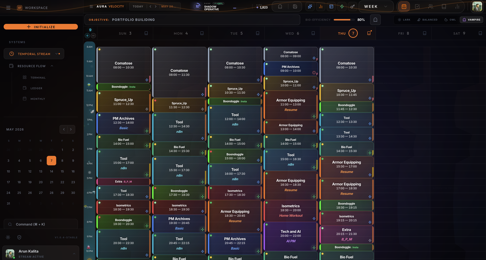
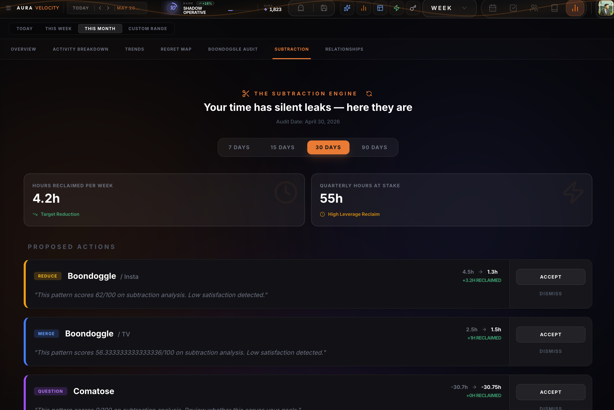
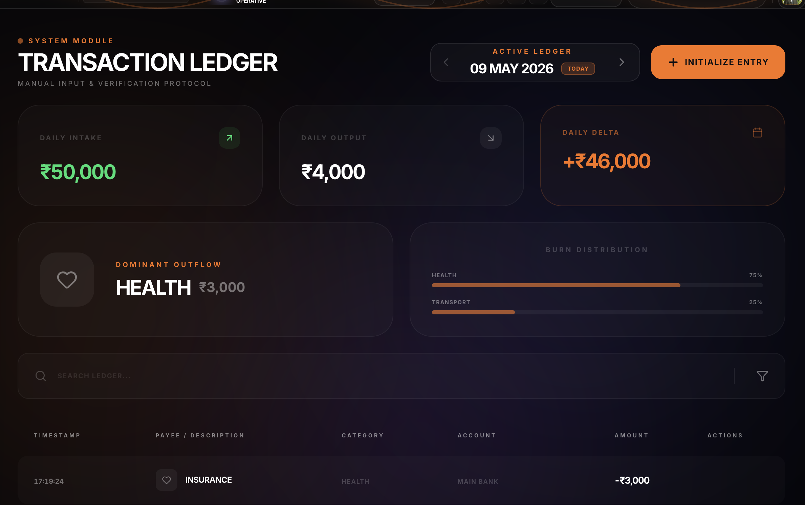

<div align="center">

# ⚡ Aura Velocity

### AI-native behavioral productivity system for time, energy, and decision-quality optimization

**Built around behavioral awareness, intentional friction, and AI-assisted decision systems**

[](https://existence-stream.web.app/)
[](https://react.dev/)
[](https://firebase.google.com/)
[](https://deepmind.google/technologies/gemini/)
[](https://existence-stream.web.app/)

---

*"Most productivity tools tell you what to add. Aura Velocity tells you what to cut."*

</div>

---
## What Is Aura Velocity?

Aura Velocity is an AI-native behavioral productivity system designed to help users make better decisions about how they spend time, energy, money, and attention.

Instead of optimizing for adding more tasks, the product focuses on identifying low-value behavioral patterns and improving decision quality through structured feedback loops.

The system combines AI-assisted behavioral audits, chronotype-aware scheduling, financial runway visibility, and planned-vs-actual behavior tracking into a single operational environment.

<p align="center">
  
</p>

## 📚 Repository Guide

| Document | Purpose |
|---|---|
| [README.md](README.md) | Quick product overview and feature walkthrough |
| [PRODUCT.md](PRODUCT.md) | Product strategy, behavioral systems thinking, and key decisions |
| [Product Case Study](./docs/aura_velocity_Case_Study.pdf) | End-to-end product narrative, evolution, and PM thinking |
| [PRD](./docs/aura_velocity_PRD.pdf) | Product requirements, prioritization, metrics, risks, and roadmap |


---

## The Problem

High-performers consistently report the same frustration: they end their days feeling busy but unable to explain where their time went. This is not a scheduling failure — it is a **visibility and accountability failure**.

| Problem | Root Cause | What Existing Tools Do |
|---|---|---|
| ⏳ **The Silent Time Leak** | No visibility into low-value habitual activity | Optimise for task completion, not task quality |
| 🧠 **Circadian Misalignment** | Scheduling by clock time ignores biological energy peaks | No tool maps activity intensity to chronotype |
| 💸 **Financial Fog** | Static bank balance obscures true financial runway | Track transactions, not survival time |
| 👥 **Relationship Decay** | No system maintains social capital proactively | CRMs exist for business, not personal relationships |

---

## 🚀 Key Systems

- **Biological Alignment Engine** — Calculates dynamic energy alignment scores based on user chronotypes and activity intensity.
- **Temporal Integrity Engine** — Custom scheduling engine with recursive exclusivity enforcement to prevent overlapping activity blocks.
- **Mechanical UI System** — High-feedback interaction architecture with tactile animations and auditory cues designed to increase behavioral accountability.
- **Subtraction Audit System** — AI-assisted retrospective analysis using regret ratings, activity intensity, and historical scheduling patterns.
- **Real-time Sync Architecture** — Local optimistic state management combined with Firebase synchronization for low-latency interactions.
- **Mobile-First Productivity Interface** — Mobile-first layout optimized for rapid scheduling, logging, and behavioral review workflows.

---

### ✂️ The Subtraction Engine — AI Audit Core

The product's defining feature. Powered by **Gemini 1.5 Flash**, the Subtraction Engine analyses 30 days of activity logs and generates specific behavioural proposals: **Purge**, **Reduce**, or **Merge**.

The system analyses historical activity patterns and generates structured proposals to reduce or eliminate recurring low-value work.

<p align="center">
  
</p>

---

### 🗓️ Temporal Integrity Engine — Zero Overlap Scheduling

A custom recursive algorithm that enforces temporal exclusivity — no two activity blocks can ever occupy the same time slot. Conflicts are resolved automatically via a **greedy forward-push cascade**.

The Heal Engine handles cross-device sync conflicts, ensuring the time log — the core data model of the entire product — is always consistent.

<p align="center">
  
</p>

---

### 🔋 Circadian Engine & Aura Score

Maps 4 chronotypes (Lark, Owl, Balanced, Vampire) to a daily energy curve. Each logged activity's intensity is scored against your biological peak at that time slot, producing the **Aura Score** — an XP-based alignment metric.

The Regret Map plots every activity on a Fulfillment vs. Energy Investment axis, revealing which activities are genuinely valuable and which are quietly draining.


---

### 💰 Resource Flow — Finance as Runway

Personal finance reframed as startup capital. The Resource Flow terminal tracks:
- **System Liquidity** — your total available capital with a real-time pulse indicator
- **Burn Rate** — average daily expenditure over the current monthly cycle
- **Runway** — days of financial freedom at current burn rate

A static bank balance tells you nothing strategic. Runway tells you everything.

<p align="center">
  
</p>

---

### 👥 Relationship Cadence — Social Capital

Relationship decay happens gradually and invisibly. The Personal CRM tracks last contact date by relationship tier (Close, Professional, Acquaintance) and surfaces proactive nudges before valuable relationships go cold.

The feature was intentionally designed as lightweight relationship maintenance rather than a traditional CRM workflow.


---

### 🧠 Scheduling Copilot — AI Slot Finder

Natural-language scheduling powered by chronotype-aware slot matching and energy-alignment logic. Type "block 3 hours for deep work before Thursday" and the copilot finds the optimal slot based on your chronotype and historical Aura Scores.

---

### 📋 Task Flow, Journal & Blueprints

- **Task Flow** — daily task management with scheduled time anchors and a built-in focus timer
- **Journal** — energy-tagged daily archives with category tagging
- **Neural Blueprint** — ideal day protocol builder for committing to planned schedules

---

### 🎛️ Mechanical UI — Tactile Accountability

Every log entry triggers a distinct auditory **"clunk"** and screen micro-feedback. The interface breathes with living background animations representing biological flow.

The interface intentionally introduces tactile feedback and interaction weight to make time logging feel consequential rather than disposable.

---

## Key Product Decisions

### 1. Subtraction over Addition
Every productivity tool on the market optimises for adding more. Aura Velocity is architecturally designed around removal. The entire data model — Regret Ratings, activity intensity scores, chronotype alignment — exists to feed one output: a ranked list of things to stop doing.

### 2. Manual Logging over Automatic Tracking
Passive time tracking was considered and intentionally rejected. The act of manually logging an activity — hearing the clunk, watching the Aura Score update — is itself a behaviour change mechanism. Passive tracking removes the psychological cost of time awareness, which is the product's core mechanism.

### 3. Forensic AI over Conversational AI
Gemini was integrated as a **batch forensic auditor**, not a chatbot. The AI receives a structured JSON payload of activity logs, regret ratings, and alignment scores once every 30 days. It returns a structured proposal. This produces higher-quality, more actionable output than continuous conversation — and every AI feature has a local fallback, so the app works fully without API access.

---

## Technical Architecture

```
[ React 19 + Vite + Tailwind + Framer Motion ]
              |
    [ AppContext — Atomic Optimistic State ]
         |                    |
[ LocalStorage ]       [ Firebase Firestore ]
  Zero latency          Background sync
         |
  [ Temporal Integrity Engine ]
  [ temporalEngine.js + Heal Engine ]
         |
  [ Gemini 1.5 Flash — Subtraction Engine ]
  [ Surgical JSON prompts → Structured proposals ]
```

| Layer | Technology | Product Reason |
|---|---|---|
| Frontend | React 19 + Vite + Tailwind | Performance as a feature — zero-latency UI |
| State | LocalStorage + Firestore | Offline-first, native feel on the web |
| AI | Gemini 1.5 Flash | Forensic auditor — not conversational AI |
| Auth | Firebase Google OAuth | Frictionless onboarding, identity-first |
| Animations | Framer Motion | Mechanical UI requires 60fps feedback |
| Custom Logic | temporalEngine.js + circadian.js | Domain too critical for generic libraries |

---

## Product Evolution Timeline

The product went through four distinct phases before reaching its current form:

| Phase | Name | Core Insight |
|---|---|---|
| 1 | **LifeApp** | Tracking *regret* is more motivating than tracking *progress* |
| 2 | **LifeOS** | Time is zero-sum — exclusivity logic must be enforced at the engine level |
| 3 | **Aura Pulse** | Biological alignment is more valuable than raw time management |
| 4 | **Aura Velocity** | Life capital (time + energy + money + relationships) must be managed as a unified system |

---

## Metrics & Success Definition

| Metric | Definition | Why It Matters |
|---|---|---|
| **North Star: Hours Reclaimed / Month** | Hours pruned via Subtraction Engine | Directly measures core value delivery |
| Aura Score Trend | Week-over-week circadian alignment change | Measures whether the product is changing scheduling behaviour |
| Mechanical Hits / Day | Daily log frequency | Baseline signal for active engagement |
| Ghost Mode Delta | Gap between planned vs. actual schedule | Shrinking delta = product is aligning intent with action |
| Runway (Days) | Financial freedom at current burn rate | Strategic life health metric |

---

## Portfolio Documents

| Document | Description |
|---|---|
| 📄 [Product Case Study](./docs/aura_velocity_Case_Study.pdf) | Full end-to-end product story — origin, problem, features, user journey, design philosophy, strategy |
| 📋 [Product Requirements Document (PRD)](./docs/aura_velocity_PRD.pdf) | Feature requirements, prioritisation matrix, success metrics, risks, and roadmap |

---

## Roadmap

- **v1.1** — Quick-start onboarding path · Subtraction proposal feedback (Accept/Reject/Modify) · Weekly Aura digest
- **v2.0** — Learning & Growth module · Fit 90 integration (unified biological performance view) · Predictive Scheduling
- **v2.5** — Predictive energy mapping · Burn Rate projections · Relationship decay probability scoring
- **v3.0** — Social Velocity: team-level Subtraction Audits for startups

---

## Product Development

Aura Velocity was designed and shipped end-to-end using AI-native development workflows with React 19, Firebase, Gemini AI, Claude, and ChatGPT.

The product was developed through rapid iteration cycles focused on behavioral systems, product tradeoffs, and decision-quality optimization.

---

<div align="center">

# 👨‍💻 Author
### Arunjyoti Kalita

🎓 MBA (Marketing & Strategy) — IIM Ranchi  
🚀 Aspiring Product Manager | AI & Automation Builder  
⚡ Exploring AI workflows, product intelligence systems, and automation-led user insights

<br>
<p align="center">
  <a href="https://linkedin.com/in/arun-kalita">
    
  </a>

  &nbsp;&nbsp;

  <a href="https://drive.google.com/drive/folders/1CGlJSAqlM5N3KBEcAA9cxQarlSr-kLnI?usp=sharing">
    
  </a>
  &nbsp;&nbsp;

  <a href="https://github.com/kalita-arun">
    
  </a>
</p>
---
